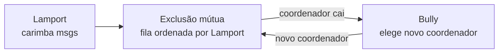
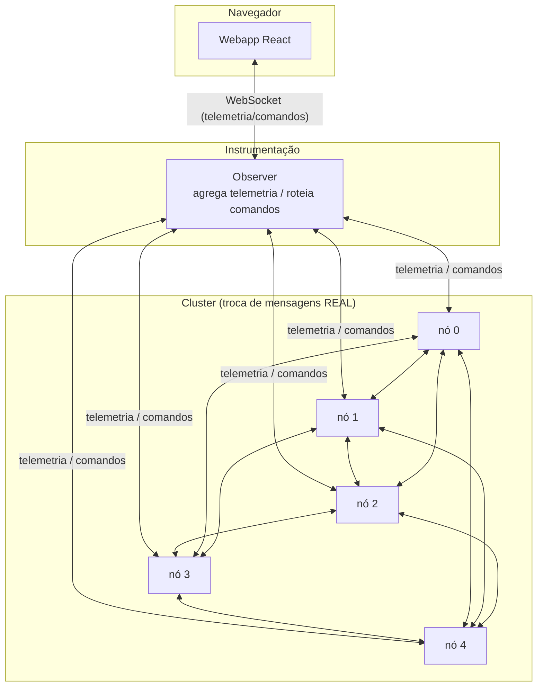
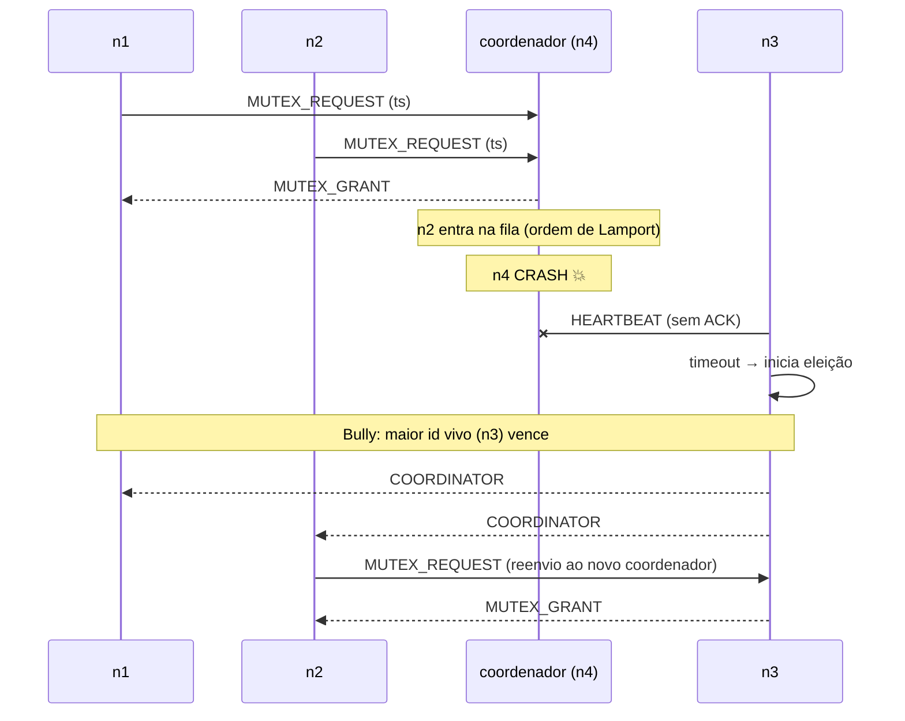

# Relatório — Trabalho 2 de MC714 (Sistemas Distribuídos)

**Instituto de Computação — UNICAMP**
**Prof. Luiz Fernando Bittencourt**

> **Integrantes:** _Nome Completo (RA)_ — **preencher** · _Nome Completo (RA)_ — **preencher**
> _(Em dupla, a entrega no Classroom é feita por apenas um integrante.)_

---

## 1. Problema

Sistemas distribuídos não têm relógio global nem memória compartilhada; os
processos só se coordenam **trocando mensagens**, sujeitas a atraso e perda, e os
processos podem falhar. Três problemas fundamentais de **coordenação** (Tanenbaum
& Van Steen, cap. 6) decorrem disso:

1. **Ordenação de eventos** sem relógio global → *relógios lógicos de Lamport*.
2. **Exclusão mútua** distribuída (garantir que só um processo entre por vez na
   seção crítica) → *algoritmo centralizado (coordenador)*.
3. **Eleição de líder** quando o coordenador falha → *algoritmo Bully*.

O objetivo deste trabalho é **implementar** esses três algoritmos sobre **troca
de mensagens real** e construir um *webapp* que os demonstra de forma **didática**,
inclusive evidenciando **seus problemas** (limite causal de Lamport, ponto único
de falha da exclusão mútua centralizada e tempestade de mensagens do Bully).

## 2. Algoritmos escolhidos

### 2.1 Relógio lógico de Lamport (1978)

Cada processo mantém um contador `C`. Regras:

- Antes de cada **evento** (interno ou **envio**): `C := C + 1`.
- Toda mensagem leva o `C` do remetente.
- Ao **receber** com timestamp `ts`: `C := max(C, ts) + 1`.

Garante: se `a → b` (a *aconteceu-antes* de b), então `C(a) < C(b)`.
**Limitação** (demonstrada no app): a recíproca não vale — `C(a) < C(b)` **não**
implica `a → b`. Eventos concorrentes recebem uma ordem total arbitrária
(desempatada por id). Detectar concorrência exigiria *vector clocks*.

### 2.2 Exclusão mútua centralizada (algoritmo do coordenador)

Um processo é o **coordenador**. Para entrar na seção crítica (SC) um processo
envia `REQUEST` ao coordenador; este responde `GRANT` se a SC está livre, ou
**enfileira** o pedido. Ao sair, o processo envia `RELEASE` e o coordenador
concede ao próximo da fila. Aqui a fila é ordenada pelo **timestamp de Lamport**
do pedido (desempate por id) — é o uso concreto do relógio lógico, dando ordem
justa a pedidos concorrentes.

Garante exclusão mútua e ausência de inanição. **Problema** (demonstrado):
o coordenador é **ponto único de falha** e gargalo.

### 2.3 Eleição Bully (Garcia-Molina, 1982)

Cada processo vigia o coordenador por *heartbeats*. Sem resposta no prazo, inicia
uma eleição enviando `ELECTION` aos processos de **id maior**. Quem recebe
responde `ANSWER` (e inicia a sua). Quem não recebe nenhum `ANSWER` vence e
anuncia `COORDINATOR` a todos. O **maior id** sempre vence — e, ao se recuperar,
reassume à força (daí o nome "valentão"). **Problemas** (demonstrados):
**tempestade de mensagens** (até O(n²)) com eleições simultâneas, e re-eleições
quando o maior id retorna.

### 2.4 Integração dos três

O **coordenador** é a peça compartilhada: o defeito da exclusão mútua
centralizada (cair) é exatamente o gatilho do algoritmo de eleição.

## 3. Implementação

### 3.1 Linguagem, bibliotecas e ambiente

- **Linguagem:** TypeScript (Node.js 22), executado com **`tsx`** (sem etapa de
  build no backend).
- **Comunicação entre nós:** **WebSocket sobre TCP**, biblioteca [`ws`](https://github.com/websockets/ws).
  Mensagens são objetos JSON.
- **Webapp:** **React 18** + **Vite 6**.
- **Ambiente de execução:** cada nó é um **processo** independente; via
  **Docker Compose**, cada nó é um **contêiner** e os nós se resolvem por nome de
  serviço na rede do Docker. Também roda localmente (5 processos em portas
  distintas) com `npm run dev`.

> **Não há simulação de troca de mensagens.** Os nós se comunicam por sockets de
> rede reais. O *observer* e o *webapp* são apenas instrumentação (observação +
> injeção de estímulos), fora do caminho de decisão dos algoritmos.

### 3.2 Componentes

- `src/shared/transport.ts` — malha WebSocket entre nós. Convenção "id menor
  conecta no id maior" garante uma conexão por par; reconexão automática; injeção
  de **atraso/descarte** por link.
- `src/shared/lamport.ts` — o relógio de Lamport (regras acima).
- `src/node/node.ts` — o nó: aplica Lamport em cada envio/recepção causal,
  roteia mensagens para os módulos de algoritmo, modela *crash/recover*, e emite
  telemetria.
- `src/node/mutex-centralized.ts` — exclusão mútua centralizada.
- `src/node/election-bully.ts` — eleição Bully + detecção de falha por heartbeat.
- `src/observer/index.ts` — recebe telemetria de cada nó, agrega a timeline e
  roteia comandos do navegador ao nó-alvo. **Não decide nada** dos algoritmos.
- `src/web/` — visualização (grafo, log, diagrama espaço-tempo) e controles.

### 3.3 Protocolo de mensagens (nó-a-nó)

Toda mensagem: `{ type, from, to, lamport, msgId, payload? }`. Tipos:

| Categoria | Tipos |
|---|---|
| Aplicação | `APP` |
| Exclusão mútua | `MUTEX_REQUEST`, `MUTEX_GRANT`, `MUTEX_RELEASE` |
| Eleição | `ELECTION`, `ANSWER`, `COORDINATOR` |
| Detecção de falha | `HEARTBEAT`, `HEARTBEAT_ACK` |

Os heartbeats são um canal de *liveness* fora-de-banda e, por decisão de projeto,
**não** participam do relógio de Lamport — isso mantém a visualização do tempo
lógico focada nos eventos de aplicação/exclusão mútua/eleição (a visualização
permite exibi-los opcionalmente).

### 3.4 Detecção de falha e modelo de crash

O `kill` modela uma falha **crash-stop**: o nó para de responder aos peers (fecha
os sockets da malha), de modo que os demais detectam a queda por (a) perda da
conexão e (b) ausência de `HEARTBEAT_ACK` no prazo. A conexão do nó com o
*observer* é mantida apenas para permitir o comando `revive`.

### 3.5 Diagrama de sequência — exclusão mútua + falha + eleição

## 4. Experimentos e resultados

Os testes foram feitos com **5 nós** (ids 0–4), tanto via `npm run dev` quanto via
`docker compose up`. Resultados observados:

1. **Lamport.** Evento interno em n0 (relógio `0→1`), envio `APP` para n2
   (`1→2`, carimba `ts=2`); n2 recebe e aplica `max(0,2)+1 = 3`. ✔ Conforme a
   regra. O diagrama espaço-tempo evidencia eventos concorrentes sem relação
   causal.
2. **Exclusão mútua.** n1 e n2 pedem a SC quase juntos: o coordenador concede a
   um e **enfileira** o outro — apenas um nó fica na SC por vez. ✔
3. **Falha do coordenador + eleição.** Ao matar o coordenador (n4) com fila
   pendente, **todos os nós que detectam a queda disparam eleição
   simultaneamente** (tempestade de mensagens `ELECTION`), o **maior id vivo
   (n3)** vence e anuncia `COORDINATOR`, e o pedido pendente é **reenviado ao novo
   coordenador e atendido**. ✔ Auto-recuperação.
4. **Valentão.** Ao reviver n4 (maior id), ele dispara eleição e **reassume** a
   coordenação. ✔
5. **Falha de rede.** Atraso/descarte no link com o coordenador provoca detecção
   de falha *falsa* e eleição desnecessária — ilustrando a fragilidade de
   detectores de falha baseados em *timeout*. ✔

A interface foi verificada no navegador em todos os cenários (estados de SC,
migração da coroa do coordenador, log e diagrama espaço-tempo).

## 5. Problemas de cada algoritmo (demonstrados)

| Algoritmo | Problema evidenciado no app |
|---|---|
| Lamport | `C(a)<C(b)` não implica `a→b`; ordem de concorrentes é arbitrária |
| Exclusão mútua centralizada | ponto único de falha / gargalo no coordenador |
| Bully | tempestade de mensagens (eleições simultâneas); re-eleição do maior id |
| Detecção por timeout | falso positivo sob atraso/perda de rede |

## 6. Comentários sobre a experiência

A maior dificuldade prática não foram os algoritmos em si, mas a **infraestrutura
de mensagens**: gerenciamento de conexões da malha, reconexão e o detector de
falha por heartbeat (o *timeout* não pode ser rearmado a cada ping, senão nunca
dispara). Modelar o crash de forma **lógica** (o nó para de responder, mas o
processo segue vivo para poder ser revivido) deixou a demonstração fluida sem
abrir mão da fidelidade — do ponto de vista dos outros nós, é indistinguível de um
crash real. A integração dos três algoritmos em torno do coordenador tornou a
demonstração coesa: o defeito de um vira a motivação do seguinte.

## 7. Fontes utilizadas e uso de código de terceiros

**Todo o código deste repositório foi escrito do zero pela equipe**, com base nas
referências abaixo. **Não** foi copiado código de terceiros / da internet; foram
consultadas apenas a documentação oficial das bibliotecas e as referências
acadêmicas para a *lógica* dos algoritmos.

**Referências dos algoritmos:**

- Lamport, L. *Time, Clocks, and the Ordering of Events in a Distributed System.*
  Communications of the ACM, 21(7), 1978.
- Garcia-Molina, H. *Elections in a Distributed Computing System.* IEEE
  Transactions on Computers, C-31(1), 1982. (algoritmo Bully)
- Tanenbaum, A. S.; Van Steen, M. *Distributed Systems: Principles and
  Paradigms* — Capítulo 6 (Coordination).
- Slides da disciplina MC714 (Prof. Luiz Fernando Bittencourt, IC–UNICAMP):
  relógios lógicos, exclusão mútua e algoritmos de eleição.

**Bibliotecas (uso conforme documentação oficial, sem código copiado):**

- [`ws`](https://github.com/websockets/ws) — WebSocket no Node.js.
- [React](https://react.dev) e [Vite](https://vitejs.dev) — webapp.
- [`tsx`](https://github.com/privatenumber/tsx) — execução de TypeScript.
- [Docker / Docker Compose](https://docs.docker.com/compose/) — contêineres.

## 8. Como reproduzir

Ver **[README.md](README.md)** (instruções de build/execução com Docker e
localmente, e o roteiro de demonstração).
